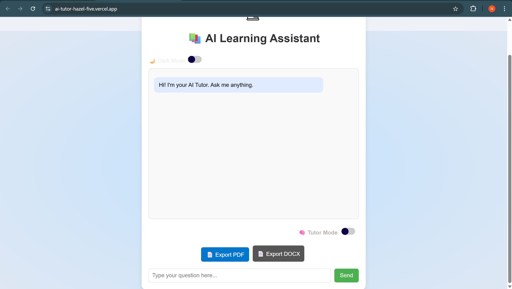
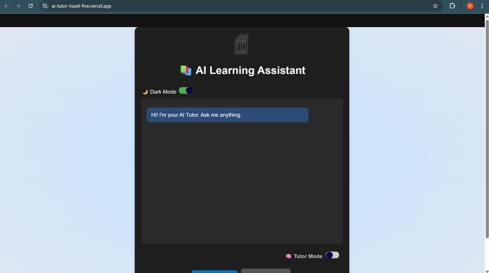

# 📚 AI Learning Assistant

An intelligent and interactive AI-powered tutor built using HTML, CSS, JavaScript, and OpenRouter API. It helps users learn concepts, ask questions, and even switch between **Tutor Mode** and **Quiz Mode**. Responsive and mobile-friendly – works seamlessly across desktops, tablets, and smartphones.

---

## 🚀 Features

- 🤖 **AI-Powered Tutor** — Ask any educational question and get clear, simple answers.
- 📝 **Quiz Mode** — Automatically generate multiple-choice quizzes on any topic.
- 🌓 **Dark Mode Toggle** — Switch between light and dark themes.
- 📱 **Fully Responsive** — Works beautifully on mobile, tablet, and desktop.
- 📄 **Export Chat** — Export your conversation to PDF or DOCX.
- 🎨 **Clean UI** — Smooth animations and modern design.

---

## 📸 Demo

👉 [Live Demo:](https://ai-tutor-hazel-five.vercel.app/)
👉 [Login Demo:](https://ai-tutor-grqz.vercel.app/)


### 🎬 Video Preview  🎥 [Watch Demo Video](https://github.com/user-attachments/assets/3a5009ff-7256-4a50-86b4-1157b169946b)
### 🎬 Video Preview  🎥 [Watch Login Demo Video](assets/logindemo.mp4)


### 🖼️ Screenshot





<!-- Hiding the live link below, so it's not visible publicly -->
<!-- 👉 [Live Demo](https://ai-tutor-hazel-five.vercel.app/) -->

---

## 🛠️ Tech Stack

- HTML5 + CSS3
- JavaScript (Vanilla)
- [OpenRouter](https://openrouter.ai) API (uses models like `mistralai/mistral-7b-instruct`)
- Responsive design using CSS Media Queries
- PDF & DOCX export using `jsPDF` and DOM Blob APIs

---

## 🧠 Modes

| Mode         | Description                        |
|--------------|------------------------------------|
| 🧠 Tutor Mode | Ask general educational questions |
| 📝 Quiz Mode  | Get 5-question MCQ quiz on any topic |

---

## ⚙️ Setup Instructions

1. Clone the Repo
   ```bash
   git clone https://github.com/nainagupta4571/Ai-tutor.git
   cd ai-learning-assistant
````

2. Generate an API Key

   * Go to [https://openrouter.ai/keys](https://openrouter.ai/keys)
   * Create your free API key
   * Replace the API key inside `script.js`:

     ```js
     Authorization: "Bearer API_Your_Key_Here"
     ```

3. Open the App
   Just open `index.html` in your browser — no build tools needed.

---

## 📁 File Structure

```
ai-learning-assistant/
├── index.html
├── style.css
├── script.js
├── README.md
└── assets/
    ├── a.png
    ├── b.png
    └── demo.mp4
```

---

## 💡 Ideas for Future

* Chat avatars & typing animation
* Save chat history locally
* Voice input and text-to-speech
* Add subject-specific tutors (e.g., Math, Science)

---

## 🤝 Contributing

Pull requests are welcome! If you'd like to improve UI, add features, or fix bugs — feel free to fork and submit a PR.

---

## 📜 License

This project is open source under the [MIT License](LICENSE).

---

## 🙌 Acknowledgements

* [OpenRouter.ai](https://openrouter.ai) — Free access to powerful language models
* [jsPDF](https://github.com/parallax/jsPDF) — PDF export

---

> Made with ❤️ to make learning more accessible.

```

